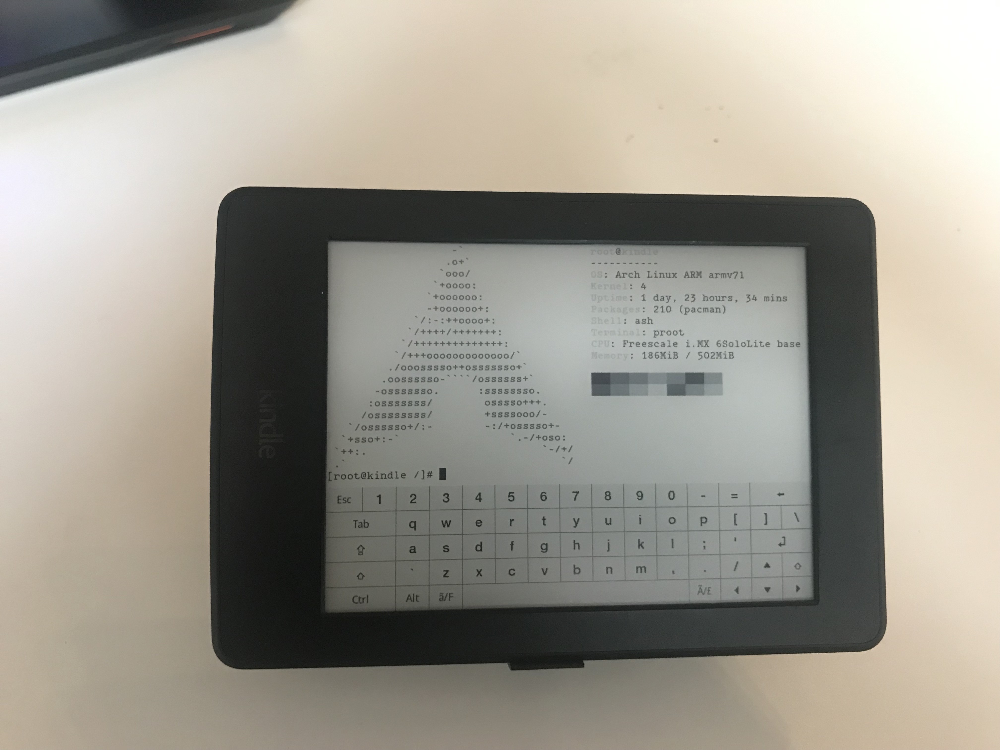

# Arch Linux on your Kindle
(Yup, I was bored)

# Proof

[More images](https://imgur.com/a/8PgtJt4)

**Warning: this "mod" breaks the USB file transfer - but you can use `scp` to transfer ebooks via WiFi (which i find even better)**.

# Instruction
## Prerequisites

* Root your Kindle: [tutorial](https://wiki.mobileread.com/wiki/Kindle_Touch_Hacking)
* Install an [application launcher KUAL](https://www.mobileread.com/forums/showthread.php?t=225030)
* Install a [terminal emulator](https://github.com/bfabiszewski/kterm)
* Enable [USBNetworking for SSH access](https://wiki.mobileread.com/wiki/Kindle_Touch_Hacking#USB_Networking) (or just use the terminal emulator)
* Check your Kindle's CPU architecture (Armv6/Armv7?)
* Format your `/dev/mmcblk0p4` to `ext3` (or `ext4`, i've only tried `ext3` because that's how Kindle's root partition was formatted by default)
* Modify your `/etc/fstab` file to look like [this](./fstab) - so the `ext3` partition will mount.

## Downloads
* Get [proot](https://proot-me.github.io/) onto your Kindle (optionally add it to PATH, it makes stuff easier later on)
* Get [ArchLinuxArm](https://archlinuxarm.org/) build for your CPU (i went with [this](https://archlinuxarm.org/platforms/armv7/freescale/usb-armory-mk-ii) for my PaperWhite 3)

## Installation
* Extract the system (preferably into `mnt/base-us/documents/arch`, but the choice is yours)
* Copy [this script](archlinux.sh) into your ebook (optionally add it to your PATH)
* Run the script

## Post-install
* [Fix the keyring](https://unix.stackexchange.com/questions/450119/pacman-cannot-install-arch-linux-keyring-on-arch-linux-arm) (`pacman` won't work otherwise):
    * `pacman-key -u`
    * `pacman-key --populate`
    